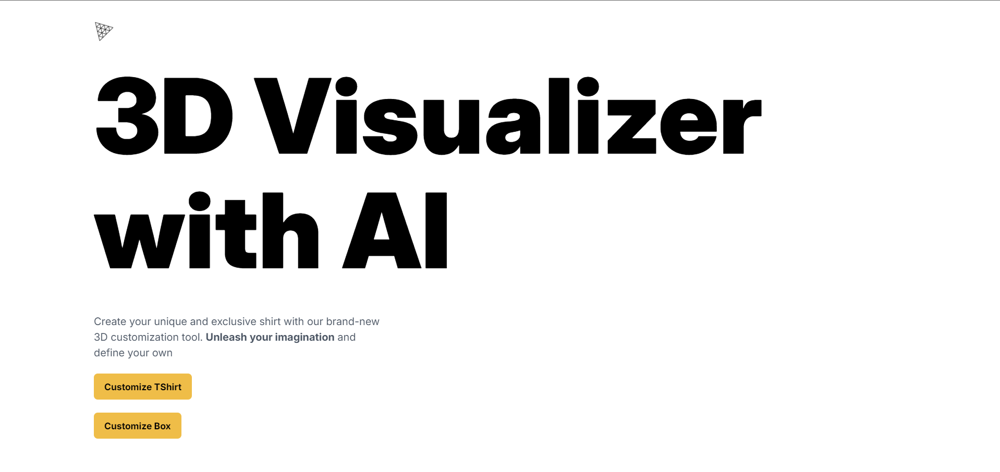
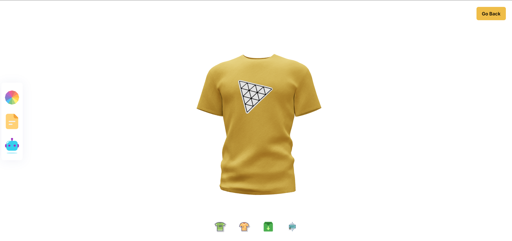
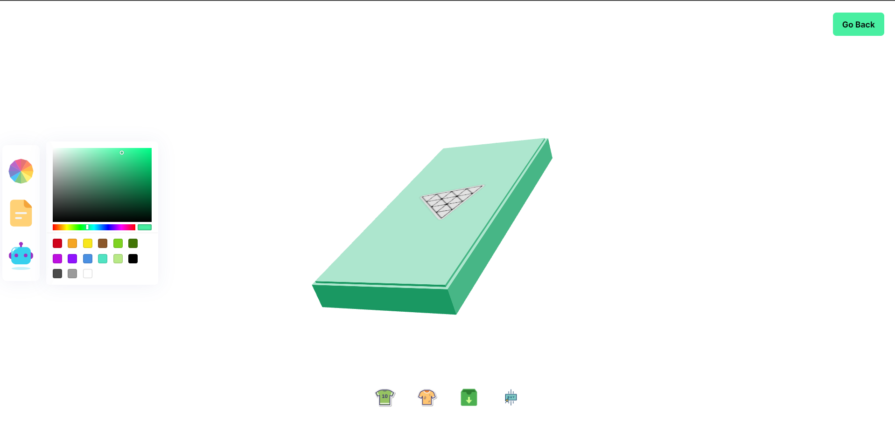

# 3D Customization Studio with AI

## Description
3D Customization Studio with AI is a web application that allows users to customize 3D models using artificial intelligence. The project includes a client-side application and a server-side API.


## Images





## Installation

### Prerequisites
- Node.js and npm installed on your machine.
- A valid ClipDrop API key.

### Steps

1. **Clone the repository**:
    ```sh
    git clone https://github.com/Boot41/Prajwal_UI.git
    ```

2. **Navigate to the project directory**:
    ```sh
    cd 3dVisualizer
    ```

3. **Install dependencies**:
    - For the client:
        ```sh
        cd client
        npm install
        ```

    - For the server:
        ```sh
        cd ../server
        npm install
        ```

4. **Set up environment variables**:
    - Create a `.env` file in the `server` directory:
        ```sh
        cd server
        echo "CLIPDROP_API_KEY=your_clipdrop_api_key" > .env
        ```

## Usage

1. **Start the client**:
    ```sh
    cd client
    npm run dev
    ```

2. **Start the server**:
    ```sh
    cd ../server
    node index.js
    ```


